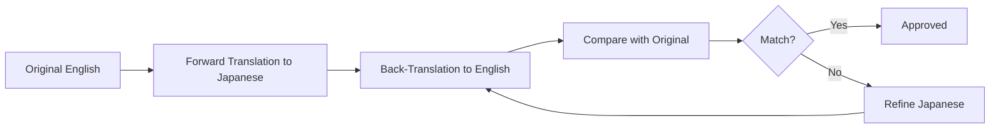

# Psychological Scale Translation Workflow

学術的に信頼できる心理尺度の日本語翻訳を作成するためのワークフロー

## Overview

心理尺度の翻訳は単なる言語変換ではなく、**測定の同等性（measurement equivalence）**を保つ必要があります。このドキュメントでは、プロジェクトの段階に応じた翻訳手順を定義します。

## Translation Phases

### Phase 1: Prototype Translation（プロトタイプ翻訳）
**目的**: MVP開発、初期ユーザーテスト
**品質基準**: 意味的に正確、自然な日本語
**バリデーション**: なし（後で実施）

### Phase 2: Academic Validation（学術的バリデーション）
**目的**: 本格運用前の信頼性・妥当性検証
**品質基準**: 学術論文で使用可能なレベル
**バリデーション**: バックトランスレーション、パイロット調査

### Phase 3: Published Version（公開版）
**目的**: 正式サービスとして提供
**品質基準**: 学術論文として公表可能
**バリデーション**: 大規模サンプルでの心理測定特性の確認

---

## Phase 1: Prototype Translation Workflow

### Step 1: Prepare Few-Shot Dataset

既存の検証済み翻訳からfew-shot examplesを準備

```typescript
// data/translations/ipip-neo-300-items-ja.csv から読み込み
const fewShotExamples = [
  {
    en: "Worry about things",
    ja: "心配性である",
    domain: "N",
    facet: "Anxiety",
    notes: "Short, natural Japanese. Use である form for traits."
  },
  {
    en: "Make friends easily",
    ja: "友達を作りやすい",
    domain: "E",
    facet: "Friendliness",
    notes: "Positive phrasing maintained in Japanese."
  },
  // ... 300項目から代表例を50-100個選定
];
```

**選定基準**:
- 各Big Five因子から均等に（N, E, O, A, C）
- 肯定文・否定文の両方を含む
- 短い文・長い文の両方を含む
- 異なる文体（だ/である、です/ます）を含む

### Step 2: Create Translation Prompt

Few-shotプロンプトを構築

```typescript
const translationPrompt = `
You are an expert translator specializing in psychological assessment scales from English to Japanese.

# Translation Guidelines

1. **Accuracy**: Preserve the psychological construct being measured
2. **Naturalness**: Use natural, fluent Japanese (avoid literal translation)
3. **Consistency**: Use consistent terminology across related items
4. **Cultural Adaptation**: Adapt idioms/examples to Japanese culture when needed
5. **Formality**:
   - Personality traits: Use だ/である form (e.g., "心配性である")
   - Questions about experiences: Use です/ます form when appropriate
   - Match the formality level of the few-shot examples

# Few-Shot Examples

${fewShotExamples.map(ex =>
  `EN: "${ex.en}"\nJA: "${ex.ja}"\nNotes: ${ex.notes}\n`
).join('\n')}

# Items to Translate

Translate the following psychological assessment items from English to Japanese:

${itemsToTranslate.map((item, i) => `${i + 1}. "${item}"`).join('\n')}

# Output Format

Provide translations in JSON format:
[
  {"item_number": 1, "english": "...", "japanese": "...", "notes": "..."},
  ...
]
`;
```

### Step 3: LLM Translation with Quality Checks

複数のLLMで翻訳を生成し、比較

```typescript
async function translateWithMultipleModels(items: string[]) {
  const models = ['claude-opus-4', 'gpt-4', 'gemini-pro'];

  const translations = await Promise.all(
    models.map(model =>
      generateTranslation(model, items, fewShotExamples)
    )
  );

  // 翻訳の一致度をチェック
  const consensus = findConsensusTranslations(translations);
  const conflicts = findConflicts(translations);

  return { consensus, conflicts };
}
```

**品質チェック項目**:
- ✅ 項目数の一致（翻訳漏れがないか）
- ✅ 文字数の妥当性（極端に短い/長い翻訳はないか）
- ✅ 逆転項目の否定表現が保持されているか
- ✅ 専門用語の一貫性（例: "self-esteem" → 常に「自尊感情」）

### Step 4: Human Review (Essential)

**バイリンガルレビュアーによる確認**:

1. **意味的等価性**: 英語版と同じ構成概念を測定しているか
2. **自然さ**: ネイティブスピーカーが読んで違和感がないか
3. **文化的適切性**: 日本文化で意味が通じるか

**レビューフォーマット**:

```csv
item_number,english,japanese_v1,reviewer_comment,japanese_final,approved
1,"I worry about things","心配性である","OK - natural and accurate","心配性である",TRUE
2,"I feel blue sometimes","時々ブルーになる","'ブルー' sounds unnatural, suggest '落ち込む'","時々落ち込む",TRUE
```

### Step 5: Consistency Check

同一尺度内での用語統一

```typescript
const terminologyMap = {
  "worry": "心配",
  "anxious": "不安",
  "nervous": "神経質",
  "self-esteem": "自尊感情",
  "self-worth": "自己価値",
  // ...
};

function checkConsistency(translations: Translation[]) {
  const issues = [];

  // 同じ英単語が異なる日本語に訳されていないかチェック
  for (const [en, expectedJa] of Object.entries(terminologyMap)) {
    const variations = findTranslationVariations(translations, en);
    if (variations.length > 1) {
      issues.push({ term: en, variations });
    }
  }

  return issues;
}
```

---

## Phase 2: Academic Validation Workflow

### Step 1: Back-Translation (バックトランスレーション)

標準的な心理尺度翻訳の手法



**実施方法**:

1. **Forward Translation**:
   - バイリンガル翻訳者A（Phase 1の成果物）

2. **Back-Translation**:
   - 別のバイリンガル翻訳者B（原文を見ずに日本語→英語に翻訳）

3. **Comparison**:
   - 原文とback-translationを比較
   - 意味のズレを特定

4. **Refinement**:
   - ズレがある項目を修正
   - 再度back-translationを実施

**ツール支援**:

```typescript
async function backTranslate(japaneseItems: string[]) {
  // 日本語→英語に翻訳（原文を与えない）
  const backTranslated = await llm.translate({
    from: 'ja',
    to: 'en',
    items: japaneseItems,
    instruction: 'Translate naturally without seeing the original English'
  });

  return backTranslated;
}

function compareTranslations(
  original: string[],
  backTranslated: string[]
): ComparisonResult[] {
  return original.map((orig, i) => {
    const back = backTranslated[i];
    const similarity = calculateSemanticSimilarity(orig, back);

    return {
      original: orig,
      backTranslated: back,
      similarity,
      needsReview: similarity < 0.85
    };
  });
}
```

### Step 2: Pilot Study (パイロット調査)

小規模サンプル（n=50-100）で心理測定特性を確認

**調査項目**:
1. ✅ **内的一貫性**: Cronbach's α ≥ 0.70
2. ✅ **因子構造**: 元の尺度と同じ因子構造か（確認的因子分析）
3. ✅ **項目-全体相関**: 各項目が尺度全体と相関しているか
4. ✅ **極端な反応分布**: 全員が同じ回答をする項目はないか

```typescript
interface PilotStudyResult {
  scale: string;
  n: number;
  cronbachAlpha: number;
  factorLoadings: number[];
  itemTotalCorrelations: number[];
  recommendations: string[];
}

function analyzePilotData(responses: Response[]): PilotStudyResult {
  return {
    cronbachAlpha: calculateAlpha(responses),
    factorLoadings: runCFA(responses),
    itemTotalCorrelations: calculateITC(responses),
    recommendations: generateRecommendations(/* ... */)
  };
}
```

### Step 3: Cognitive Interviewing (認知的面接)

被験者に「何を考えて回答したか」をインタビュー

**質問例**:
- 「この質問文を読んで、どのような意味だと理解しましたか？」
- 「この質問に答える時、どのような例を思い浮かべましたか？」
- 「この質問文で、わかりにくい部分はありましたか？」

**目的**:
- 意図しない解釈をされていないか確認
- 文化的に不適切な表現がないか確認
- 回答の困難さを確認

---

## Phase 3: Published Version Workflow

### Step 1: Large-Scale Validation Study

大規模サンプル（n=300-500）で再度バリデーション

**確認項目**:
1. ✅ 内的一貫性（Cronbach's α）
2. ✅ 再テスト信頼性（2週間後に再測定、r ≥ 0.70）
3. ✅ 構成概念妥当性（他の関連尺度との相関）
4. ✅ 因子構造の確認（CFA）
5. ✅ 測定不変性（性別、年齢群間で同じように機能するか）

### Step 2: Publication

学術論文として公開

**論文構成**:
1. Introduction: 尺度の背景と翻訳の必要性
2. Method: 翻訳手順（back-translation等）とバリデーション方法
3. Results: 信頼性・妥当性のデータ
4. Discussion: 翻訳版の限界と今後の展望
5. Appendix: **全項目の英日対照表**

**投稿先候補**:
- 『心理学研究』（Japanese Psychological Research）
- 『パーソナリティ研究』
- International journals (e.g., Assessment, Psychological Assessment)

### Step 3: Open Access Publication

翻訳を広く利用可能にする

**方法**:
1. **GitHub repository**: 翻訳版をオープンソースで公開
2. **OSF (Open Science Framework)**: 研究データとして登録
3. **psychtest.jp**: サイト上で「学術的に検証済み」として提供

**ライセンス**:
```
Creative Commons Attribution 4.0 International (CC BY 4.0)

This Japanese translation is freely available for:
- ✅ Academic research
- ✅ Clinical use
- ✅ Commercial use
- ✅ Derivative works

Requirements:
- Cite the validation paper
- Acknowledge psychtest.jp
```

---

## Quality Assurance Checklist

### For Each Translated Scale

#### Translation Quality
- [ ] All items translated (no missing items)
- [ ] Natural Japanese (reviewed by native speaker)
- [ ] Consistent terminology across items
- [ ] Reverse-scored items clearly marked
- [ ] Cultural adaptations documented

#### Psychometric Quality (Phase 2+)
- [ ] Cronbach's α ≥ 0.70
- [ ] Factor structure matches original
- [ ] Item-total correlations acceptable (r > 0.30)
- [ ] No extreme response patterns
- [ ] Back-translation completed

#### Documentation
- [ ] Translation method documented
- [ ] Translator qualifications noted
- [ ] Sample characteristics recorded (n, age, gender)
- [ ] Reliability coefficients reported
- [ ] Limitations acknowledged

#### Legal/Ethical
- [ ] Original scale permissions obtained (if needed)
- [ ] IRB approval for validation study (if human subjects)
- [ ] Data privacy compliance (GDPR, etc.)
- [ ] Proper citation of original scale

---

## Recommended Tools

### Translation
- **LLM APIs**: Claude Opus 4, GPT-4, Gemini Pro
- **Few-shot management**: Custom TypeScript/Python scripts
- **Human review**: Google Sheets with commenting

### Validation
- **Statistical analysis**: R (psych, lavaan packages) or Python (factor_analyzer, pingouin)
- **Survey platform**: Google Forms, Qualtrics, LimeSurvey
- **Data management**: PostgreSQL, CSV files in git

### Documentation
- **Version control**: Git + GitHub
- **Data repository**: OSF, figshare
- **Bibliography**: Zotero, Mendeley

---

## Timeline Estimates

### Phase 1: Prototype (1 scale)
- Few-shot preparation: 2 hours
- LLM translation: 1 hour
- Human review: 4-8 hours
- Consistency check: 2 hours
- **Total**: 1-2 days

### Phase 2: Validation (1 scale)
- Back-translation: 1 week
- Pilot study (recruit + analyze): 2-4 weeks
- Cognitive interviewing: 1 week
- Refinement: 1 week
- **Total**: 1-2 months

### Phase 3: Publication (1 scale)
- Large-scale study: 2-3 months
- Analysis + writing: 1 month
- Peer review: 3-6 months
- **Total**: 6-12 months

---

## Practical Workflow for psychtest.jp

### MVP Approach (Recommended)

**Priority 1**: Implement existing validated translations
- Use IPIP-NEO-300 (already validated) ✅
- Use Rosenberg (if license permits)
- Use SWLS (if license permits)

**Priority 2**: Create prototype translations (Phase 1)
- PHQ-9, GAD-7, SCCS
- Deploy as "beta" versions with disclaimer
- Collect user feedback

**Priority 3**: Academic validation (Phase 2)
- Run pilot studies on priority scales
- Publish validation papers
- Upgrade to "validated" status

**Priority 4**: Expand library (Phase 1 → 2 → 3)
- Add more scales incrementally
- Each goes through full validation cycle

### Disclaimer for Prototype Versions

```
⚠️ この尺度は現在ベータ版です

この日本語版は学術的バリデーションを実施中です。
研究や臨床での使用には、正式な検証済み版の完成をお待ちください。

個人的な自己理解の参考としてご利用いただけますが、
診断や重要な意思決定の根拠とはしないでください。
```

---

## Summary: Recommended Translation Process

### For psychtest.jp MVP

1. ✅ **Use IPIP-NEO-300 as few-shot data** (300 validated items)
2. ✅ **Phase 1 translation for new scales** (LLM + human review)
3. ✅ **Deploy as "beta" with disclaimers**
4. ✅ **Collect user data for validation**
5. ✅ **Phase 2 validation when traffic grows**
6. ✅ **Publish validation papers** (establish academic credibility)
7. ✅ **Iterate and improve based on data**

This approach balances:
- 🚀 Speed to market (Phase 1 can be done in days)
- 📊 Academic rigor (Phase 2-3 for long-term credibility)
- ⚖️ Legal safety (clear disclaimers, gradual validation)
- 💰 Cost efficiency (start lean, invest in validation as revenue grows)
